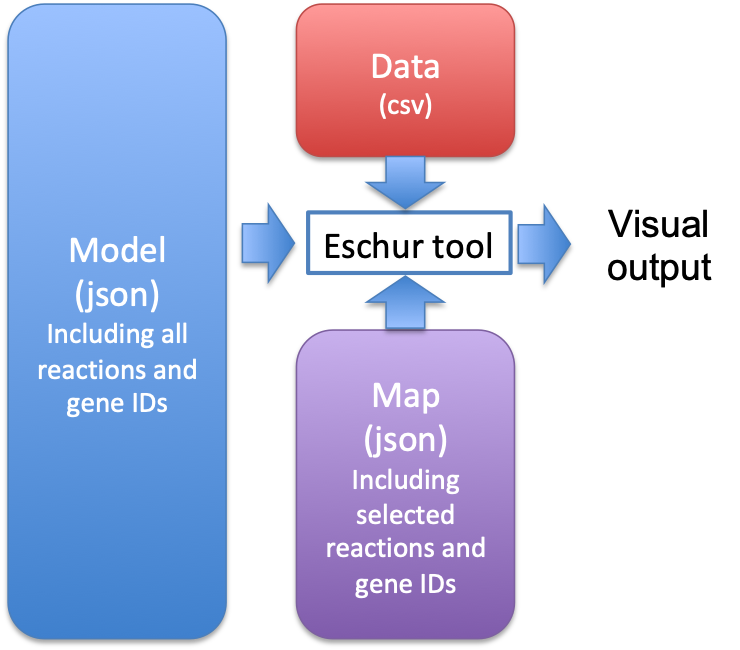

# COnstraint-Based Reconstruction and Analysis (Cobra) - demo with Phaeodactylum tricornutum  

Cobra is a kind of genome-scale modeling of metabolic networks in both prokaryotes and eukaryotes. Instructions for installation and implementation of this tool can be found here (https://cobrapy.readthedocs.io). Here we demostrate the application of our reconstructed whole genome model using Cobra tool.

### Visualize differcial expression data
* Visualization tool - https://escher.github.io/

The use of Cobra model requires minimal of two files: The map.json file and the data.csv file. The backbone model.json file is optional, and only required if you plan to add additional reactions that are not included in the map.json for visualization. Here is a quick illustration of the workflow.

</img>

To use the escher tool for visualize RNA or differencial expression data, go to https://escher.github.io/, set 'Map' to 'None', and click 'Load map'. In the opened white board, click 'Map' -> 'Load map', and select the json file we provided in the map folder. Next, click 'Data' -> 'Load gene', and select the sample file we provided in the Data folder (WT_HL_to_WT_LL.csv). In this example, we have normalized RNA-seq data from low light and high light experiments stored in two coumns. The control should be in the first column and the treatment sample should be in the second column. It is important to set the name of index to 'Gene_id', so the webapp can recognize it. If you are interested in adding other reactions to the map, the model.json file is also provided.

Now you should be able to see the result like this.

</img>

You can also put data from just one RNA-seq result and see the absolute value of it. Remember to change the settings and make sure the scales are what you expected.

This tool can also be used for visulize flux results; you can see by selecting 'Data' -> 'Load reactions'. We provided an example file for comparing metabolic flux under low and high light conditions here as well (Flux_LL_HL.csv). For the reaction data, set the name of index to 'rxn'.

</img>

### Simulation 
The Flux data was generated from model simulation, in the notebook we provided a simple example on how to run constrained flux analysis under mass balanced condition. For more advanced users, please see the full simulation work we conducted in the full_model folder. This work has been published at: https://nph.onlinelibrary.wiley.com/doi/10.1111/nph.15685.

